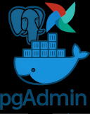

<!-- Improved compatibility of back to top link: See: https://github.com/othneildrew/Best-README-Template/pull/73 -->
<a id="readme-top"></a>
<!--
*** Thanks for checking out the Best-README-Template. If you have a suggestion
*** that would make this better, please fork the repo and create a pull request
*** or simply open an issue with the tag "enhancement".
*** Don't forget to give the project a star!
*** Thanks again! Now go create something AMAZING! :D
-->


<!-- PROJECT SHIELDS -->
<!--
*** I'm using markdown "reference style" links for readability.
*** Reference links are enclosed in brackets [ ] instead of parentheses ( ).
*** See the bottom of this document for the declaration of the reference variables
*** for contributors-url, forks-url, etc. This is an optional, concise syntax you may use.
*** https://www.markdownguide.org/basic-syntax/#reference-style-links
-->
<!--    Add these later...
[![Contributors][contributors-shield]][https://github.com/kc8son]
[![Forks][forks-shield]][forks-url]
[![Stargazers][stars-shield]][stars-url]
[![Issues][issues-shield]][issues-url]
[![project_license][license-shield]][license-url]
[![LinkedIn][linkedin-shield]][linkedin-url]
Original README.md:  https://github.com/othneildrew/Best-README-Template/blob/main/BLANK_README.md
-->


<!-- PROJECT LOGO -->
<br />
<div align="center">
  <a href="https://github.com/kc8son/docker">
    
  </a>

<h3 align="center">Docker config files</h3>

  <p align="center">
    Docker is an open-source platform that allows developers to build, deploy, and manage applications in lightweight containers. These containers package an application along with its dependencies, enabling it to run consistently across different environments.  I use docker to spin up various servers including postgreSQL database (including pgAdmin), MS SQL Server databases, Apache Airflow, Couchbase and MongoDB.
    <br />
    <a href="https://github.com/kc8son/docker"><strong>Explore the docs »</strong></a>
    <br />
    <br />
    <a href="https://github.com/kc8son/docker">View Demo</a>
    &middot;
    <a href="https://github.com/kc8son/docker/issues/new?labels=bug&template=bug-report---.md">Report Bug</a>
    &middot;
    <a href="https://github.com/kc8son/docker/issues/new?labels=enhancement&template=feature-request---.md">Request Feature</a>
  </p>
</div>


<!-- TABLE OF CONTENTS -->
<details>
  <summary>Table of Contents</summary>
  <ol>
    <li>
      <a href="#about-the-project">About The Project</a>
      <ul>
        <li><a href="#built-with">Built With</a></li>
      </ul>
    </li>
    <li>
      <a href="#getting-started">Getting Started</a>
      <ul>
        <li><a href="#prerequisites">Prerequisites</a></li>
        <li><a href="#installation">Installation</a></li>
      </ul>
    </li>
    <li><a href="#usage">Usage</a></li>
    <li><a href="#roadmap">Roadmap</a></li>
    <li><a href="#contributing">Contributing</a></li>
    <li><a href="#license">License</a></li>
    <li><a href="#contact">Contact</a></li>
    <li><a href="#acknowledgments">Acknowledgments</a></li>
  </ol>
</details>


<!-- ABOUT THE PROJECT -->
## About The Project

<!--  [![Product Name Screen Shot][product-screenshot]](https://example.com) -->

This is simply a list of various docker images that I run for my personal training and use.

<p align="right">(<a href="#readme-top">back to top</a>)</p>


### Built With

* [![Docker][Docker.js]][Docker-url]
* [![VSCode][vscode.js]][vscode-url]
* [![Airflow][airflow.js]][airflow-url]
* [![postgreSQL][postgreSQL.js]][postgreSQL-url]

<p align="right">(<a href="#readme-top">back to top</a>)</p>


<!-- GETTING STARTED -->
## Getting Started
* First install docker. 
* Then create a folder for your server (postgresql or airflow for example). 
* Within that folder, create any folders needed to persist data - expecially for database servers.  
* within that folder from the command line 'docker compose up -d'  

<!-- 
### Prerequisites

This is an example of how to list things you need to use the software and how to install them.
* npm
  ```sh
  npm install npm@latest -g
  ```

### Installation

1. Get a free API Key at [https://example.com](https://example.com)
2. Clone the repo
   ```sh
   git clone https://github.com/kc8son/docker.git
   ```
3. Install NPM packages
   ```sh
   npm install
   ```
4. Enter your API in `config.js`
   ```js
   const API_KEY = 'ENTER YOUR API';
   ```
5. Change git remote url to avoid accidental pushes to base project
   ```sh
   git remote set-url origin kc8son/docker
   git remote -v # confirm the changes
   ```
 -->
<p align="right">(<a href="#readme-top">back to top</a>)</p>


<!-- USAGE EXAMPLES -->
## Usage


<p align="right">(<a href="#readme-top">back to top</a>)</p>


<!-- ROADMAP -->
## Roadmap

- [ ] Feature 1
- [ ] Feature 2
- [ ] Feature 3
    - [ ] Nested Feature

See the [open issues](https://github.com/kc8son/docker/issues) for a full list of proposed features (and known issues).

<p align="right">(<a href="#readme-top">back to top</a>)</p>


<!-- CONTRIBUTING -->
## Contributing

Contributions are what make the open source community such an amazing place to learn, inspire, and create. Any contributions you make are **greatly appreciated**.

If you have a suggestion that would make this better, please fork the repo and create a pull request. You can also simply open an issue with the tag "enhancement".
Don't forget to give the project a star! Thanks again!

1. Fork the Project
2. Create your Feature Branch (`git checkout -b feature/AmazingFeature`)
3. Commit your Changes (`git commit -m 'Add some AmazingFeature'`)
4. Push to the Branch (`git push origin feature/AmazingFeature`)
5. Open a Pull Request

<p align="right">(<a href="#readme-top">back to top</a>)</p>

### Top contributors:

<a href="https://github.com/kc8son/docker/graphs/contributors">
  
</a>


<!-- LICENSE -->
## License

Distributed under the project_license. See `LICENSE.txt` for more information.

<p align="right">(<a href="#readme-top">back to top</a>)</p>


<!-- CONTACT -->
## Contact

Your Name - [@twitter_handle](https://twitter.com/twitter_handle) - kc8son@yahoo.com

Project Link: [https://github.com/kc8son/docker](https://github.com/kc8son/docker)

<p align="right">(<a href="#readme-top">back to top</a>)</p>


<!-- ACKNOWLEDGMENTS -->
## Acknowledgments

* []()
* []()
* []()

<p align="right">(<a href="#readme-top">back to top</a>)</p>


<!-- MARKDOWN LINKS & IMAGES -->
<!-- https://www.markdownguide.org/basic-syntax/#reference-style-links -->
[contributors-shield]: https://img.shields.io/github/contributors/kc8son/docker.svg?style=for-the-badge
[contributors-url]: https://github.com/kc8son/docker/graphs/contributors
[forks-shield]: https://img.shields.io/github/forks/kc8son/docker.svg?style=for-the-badge
[forks-url]: https://github.com/kc8son/docker/network/members
[stars-shield]: https://img.shields.io/github/stars/kc8son/docker.svg?style=for-the-badge
[stars-url]: https://github.com/kc8son/docker/stargazers
[issues-shield]: https://img.shields.io/github/issues/kc8son/docker.svg?style=for-the-badge
[issues-url]: https://github.com/kc8son/docker/issues
[license-shield]: https://img.shields.io/github/license/kc8son/docker.svg?style=for-the-badge
[license-url]: https://github.com/kc8son/docker/blob/master/LICENSE.txt
[linkedin-shield]: https://img.shields.io/badge/-LinkedIn-black.svg?style=for-the-badge&logo=linkedin&colorB=555
[linkedin-url]: https://linkedin.com/in/joseph-merten/
[product-screenshot]: images/screenshot.png
[Next.js]: https://img.shields.io/badge/next.js-000000?style=for-the-badge&logo=nextdotjs&logoColor=white
[Next-url]: https://nextjs.org/
[React.js]: https://img.shields.io/badge/React-20232A?style=for-the-badge&logo=react&logoColor=61DAFB

[Docker-url]: https://www.docker.com/products/docker-desktop/
[Docker.js]: images/docker_small.png

[VSCode-url]: https://code.visualstudio.com/download
[VSCode.js]: images/vscode_small.png

[airflow-url]: https://airflow.apache.org/
[airflow.js]: images/airflow_small.png

[postgresql-url]: https://www.postgresql.org/
[postgresql.js]: images/postgresql_small.png

[React-url]: https://reactjs.org/
[Vue.js]: https://img.shields.io/badge/Vue.js-35495E?style=for-the-badge&logo=vuedotjs&logoColor=4FC08D
[Vue-url]: https://vuejs.org/
[Angular.io]: https://img.shields.io/badge/Angular-DD0031?style=for-the-badge&logo=angular&logoColor=white
[Angular-url]: https://angular.io/
[Svelte.dev]: https://img.shields.io/badge/Svelte-4A4A55?style=for-the-badge&logo=svelte&logoColor=FF3E00
[Svelte-url]: https://svelte.dev/
[Laravel.com]: https://img.shields.io/badge/Laravel-FF2D20?style=for-the-badge&logo=laravel&logoColor=white
[Laravel-url]: https://laravel.com
[Bootstrap.com]: https://img.shields.io/badge/Bootstrap-563D7C?style=for-the-badge&logo=bootstrap&logoColor=white
[Bootstrap-url]: https://getbootstrap.com
[JQuery.com]: https://img.shields.io/badge/jQuery-0769AD?style=for-the-badge&logo=jquery&logoColor=white
[JQuery-url]: https://jquery.com 
